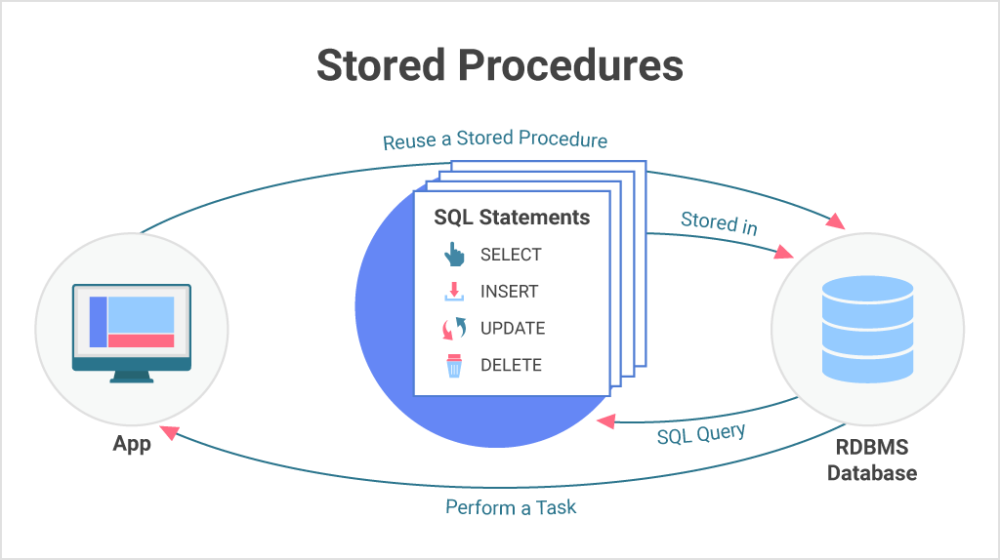
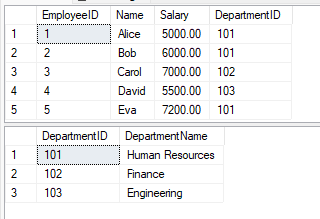
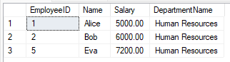
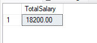

# Stored Procedures and Triggers

### What is Stored Procedures?
 - A stored procedure is a precompiled collection of one or more SQL statements stored in the database. It can be executed multiple times with different parameters, allowing for efficient reuse of logic, reduced duplication, and better performance.
 - Stored procedures support input parameters, allow encapsulation of logic, and can perform a wide range of operations like data manipulation, validation, transactions, and reporting.

  

   ### Benefits of Stored Procedures

 -  **Performance Optimization** 		
	- Stored procedures are compiled once and stored as executable plans.
On subsequent calls, the database reuses the compiled plan, speeding up execution.
 -  **Reduced Network Traffic**
	- Since stored procedures encapsulate multiple SQL statements, only the procedure call is sent over the network, not each individual SQL statement.
 -  **Improved Security**
		- Users can be granted permission to execute a stored procedure without having direct access to underlying tables.
Using EXECUTE AS can impersonate specific users and protect sensitive data.
 - **Code Reusability & Maintainability**
	- Avoids repeating code for repetitive tasks.
	- If changes are needed, only the stored procedure needs to be updated—not every application or client that uses it.
 - **Error Handling**
	- SQL Server supports error handling with TRY...CATCH blocks inside procedures.
 - **Modularity & Abstraction**
	- Procedures let you abstract complex SQL logic away from client applications.
	- Parameters can be used for dynamic input.
	
	### Drawbacks of Stored Procedures 


 - **Debugging Difficulty:** 
	 Debugging can be more complex compared to regular SQL.
 - **Versioning:** 
	Harder to manage versions compared to application code.
 - **Portability:** 
    Procedures are often tied to a specific DBMS (e.g., SQL Server vs Oracle).
 - **Testing Complexity:** 
	Errors may only surface at runtime.
 - **Resource Overhead:** 
	Complex or overused procedures can consume server resources.
 - **Developer Costs:** 
	Writing efficient procedures may require skilled DBAs or SQL developers.
	
	 ### Type of Stored Procedures

- **User-defined:**
A user-defined procedure can be created in a user-defined database or in all system databases except the Resource database. The procedure can be developed in either Transact-SQL, or as a reference to a Microsoft .NET Framework common runtime language (CLR) method.
- **Temporary:**
Temporary procedures are a form of user-defined procedures. Temporary procedures are like a permanent procedure, except that they're stored in tempdb. There are two types of temporary procedures: local and global. They differ from each other in their names, their visibility, and their availability. Local temporary procedures have a single number sign (#) as the first character of their names; they're visible only to the current user connection, and they're deleted when the connection is closed. Global temporary procedures have two number signs (##) as the first two characters of their names; they're visible to any user after they are created, and they're deleted at the end of the last session using the procedure.
- **System:**
System procedures are included with the Database Engine. They are physically stored in the internal, hidden Resource database and logically appear in the sys schema of every system-defined and user-defined database. In addition, the msdb database also contains system stored procedures in the dbo schema that are used for scheduling alerts and jobs. Because system procedures start with the prefix sp_, we recommend that you don't use this prefix when naming user-defined procedures. For a complete list of system procedures, see System stored procedures (Transact-SQL).
SQL Server supports the system procedures that provide an interface from SQL Server to external programs for various maintenance activities. These extended procedures use the xp_ prefix. For a complete list of extended procedures, see General extended stored procedures (Transact-SQL).
- **Extended user-defined:**
Extended procedures enable creating external routines in a programming language such as C. These procedures are DLLs that an instance of SQL Server can dynamically load and run.

	
	**~~NOTE:~~** Extended stored procedures will be removed in a future version of SQL Server. Don't use this feature in new development work.

- **Stored Procedures in CLR:**
These are SQL Server-based stored procedures that are written in.NET languages, 
such as C#. When complex functionality is required that is difficult to implement with 
T-SQL alone, such as interacting with external APIs or complex string manipulation, 
CLR stored procedures can be helpful. 

### Stored Procrdures ( Syntax with Example )

### Stored Procedure Syntax
 ```sql
CREATE PROCEDURE procedure_name
AS
BEGIN
   --sql_statement
END;
```
#### Execute a Stored Procedure
```sql
EXEC procedure_name;
 ```

 --------------
### Stored Procedure Example
 ```sql
CREATE PROCEDURE SelectAllCustomers
AS
BEGIN
SELECT * FROM Customers
END;
```

#### Execute a Stored Procedure Example
```sql
EXEC SelectAllCustomers;

 ```
 -----------

 ### Stored Procedure With One Parameter
 ```sql
CREATE PROCEDURE procedure_name @Parameter_name datatype
AS
BEGIN
--sql_statement with  @Parameter_name
END;
 ```

#### Example of a Stored Procedure with Parameter

 ```sql
CREATE PROCEDURE SelectAllCustomers @City nvarchar(30)
AS
BEGIN
SELECT * FROM Customers WHERE City = @City
END;
```
#### Execute a Stored Procedure with Parameter
```sql
EXEC SelectAllCustomers @City = 'London';
 ```
 
 -------------
 ### Stored Procedure With Multiple Parameters
 ```sql

CREATE PROCEDURE procedure_name @Parameter_name1 datatype , @Parameter_name2 datatype
AS
BEGIN
--sql_statement with  @Parameter_name1 ,@Parameter_name2
END;
 ```
#### Example of a Stored Procedure with Multiple Parameters
 ```sql
CREATE PROCEDURE SelectAllCustomers @City nvarchar(30), @PostalCode nvarchar(10)
AS
BEGIN
SELECT * FROM Customers WHERE City = @City AND PostalCode = @PostalCode
END;
 ```
 #### Execute a Stored Procedure With Multiple Parameters
  
 ```sql
EXEC SelectAllCustomers @City = 'London', @PostalCode = 'WA1 1DP';
 ```

 -------------
 
 ### Apply Stored Procedure in Practice
 #### # Create a Database and Tables
 ```sql
 -- Cerate Database 
create database TeamworkDB

-- use Database
use TeamworkDB

-- Create Departments table
CREATE TABLE Departments (
    DepartmentID INT PRIMARY KEY,
    DepartmentName VARCHAR(100) NOT NULL
);

-- Create Employees table with foreign key to Departments
CREATE TABLE Employees (
    EmployeeID INT IDENTITY PRIMARY KEY,
    Name VARCHAR(100) NOT NULL,
    Salary DECIMAL(10, 2) NOT NULL,
    DepartmentID INT NOT NULL,
    FOREIGN KEY (DepartmentID) REFERENCES Departments(DepartmentID)
);

-- Insert sample data into Departments
INSERT INTO Departments (DepartmentID, DepartmentName) VALUES
(101, 'Human Resources'),
(102, 'Finance'),
(103, 'Engineering');

-- Insert sample data into Employees
INSERT INTO Employees (Name, Salary, DepartmentID) VALUES
('Alice', 5000.00, 101),
('Bob', 6000.00, 101),
('Carol', 7000.00, 102),
('David', 5500.00, 103),
('Eva', 7200.00, 101);


-- Insert sample data into Departments
INSERT INTO Departments (DepartmentID, DepartmentName) VALUES
(101, 'Human Resources'),
(102, 'Finance'),
(103, 'Engineering');

-- Insert sample data into Employees
INSERT INTO Employees (Name, Salary, DepartmentID) VALUES
('Alice', 5000.00, 101),
('Bob', 6000.00, 101),
('Carol', 7000.00, 102),
('David', 5500.00, 103),
('Eva', 7200.00, 101);


```
#### Tables info

-----
#### # Create a Stored Procedure with One Parameter
```sql
CREATE PROCEDURE GetEmployeesByDepartment
    @DepartmentID INT
AS
BEGIN
    SELECT e.EmployeeID, e.Name, e.Salary, d.DepartmentName
    FROM Employees e
    INNER JOIN Departments d ON e.DepartmentID = d.DepartmentID
    WHERE e.DepartmentID = @DepartmentID;
END;
```
#### How to Execute It 
```sql
EXEC GetEmployeesByDepartment @DepartmentID = 101;
```
#### Output of the Stored Procedure


----
#### # Create a Stored Procedure with Two Parameter
#### Create stored procedure to calculate total salary by department ( Multi Parameters )
```sql
CREATE PROCEDURE CalculateTotalSalaryByDepartment
    @DepartmentID INT,               -- Input parameter
    @TotalSalary DECIMAL(10, 2) OUTPUT  -- Output parameter
AS
BEGIN
    SELECT @TotalSalary = SUM(Salary)
    FROM Employees
    WHERE DepartmentID = @DepartmentID;
END;

```

#### How to Execute It 
```sql
-- Declare a variable to hold the output
DECLARE @Result DECIMAL(10, 2);

-- Call the procedure
EXEC CalculateTotalSalaryByDepartment
    @DepartmentID = 101,
    @TotalSalary = @Result OUTPUT;

-- Display the result
SELECT @Result AS TotalSalary;
```

#### Output of the Stored Procedure
