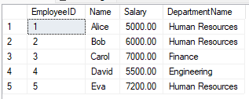
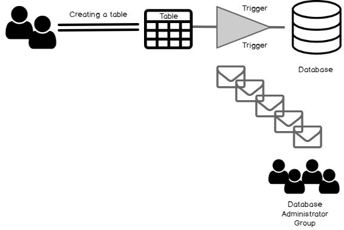
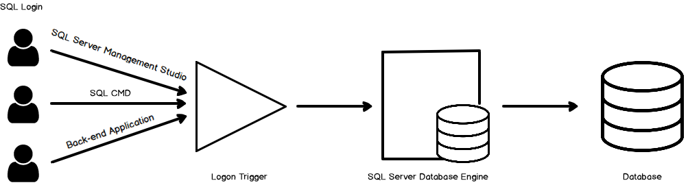
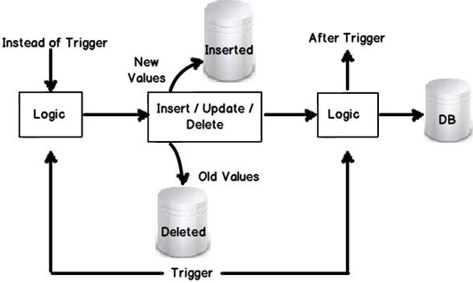
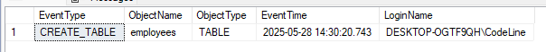

# Stored Procedures and Triggers

### What is Stored Procedures?
 - A stored procedure is a precompiled collection of one or more SQL statements stored in the database. It can be executed multiple times with different parameters, allowing for efficient reuse of logic, reduced duplication, and better performance.
 - Stored procedures support input parameters, allow encapsulation of logic, and can perform a wide range of operations like data manipulation, validation, transactions, and reporting.

  

   ### Benefits of Stored Procedures

 -  **Performance Optimization** 		
	- Stored procedures are compiled once and stored as executable plans.
On subsequent calls, the database reuses the compiled plan, speeding up execution.
 -  **Reduced Network Traffic**
	- Since stored procedures encapsulate multiple SQL statements, only the procedure call is sent over the network, not each individual SQL statement.
 -  **Improved Security**
		- Users can be granted permission to execute a stored procedure without having direct access to underlying tables.
Using EXECUTE AS can impersonate specific users and protect sensitive data.
 - **Code Reusability & Maintainability**
	- Avoids repeating code for repetitive tasks.
	- If changes are needed, only the stored procedure needs to be updated—not every application or client that uses it.
 - **Error Handling**
	- SQL Server supports error handling with TRY...CATCH blocks inside procedures.
 - **Modularity & Abstraction**
	- Procedures let you abstract complex SQL logic away from client applications.
	- Parameters can be used for dynamic input.
	
	### Drawbacks of Stored Procedures 


 - **Debugging Difficulty:** 
	 Debugging can be more complex compared to regular SQL.
 - **Versioning:** 
	Harder to manage versions compared to application code.
 - **Portability:** 
    Procedures are often tied to a specific DBMS (e.g., SQL Server vs Oracle).
 - **Testing Complexity:** 
	Errors may only surface at runtime.
 - **Resource Overhead:** 
	Complex or overused procedures can consume server resources.
 - **Developer Costs:** 
	Writing efficient procedures may require skilled DBAs or SQL developers.
	
	 ### Type of Stored Procedures

- **User-defined:**
A user-defined procedure can be created in a user-defined database or in all system databases except the Resource database. The procedure can be developed in either Transact-SQL, or as a reference to a Microsoft .NET Framework common runtime language (CLR) method.
- **Temporary:**
Temporary procedures are a form of user-defined procedures. Temporary procedures are like a permanent procedure, except that they're stored in tempdb. There are two types of temporary procedures: local and global. They differ from each other in their names, their visibility, and their availability. Local temporary procedures have a single number sign (#) as the first character of their names; they're visible only to the current user connection, and they're deleted when the connection is closed. Global temporary procedures have two number signs (##) as the first two characters of their names; they're visible to any user after they are created, and they're deleted at the end of the last session using the procedure.
- **System:**
System procedures are included with the Database Engine. They are physically stored in the internal, hidden Resource database and logically appear in the sys schema of every system-defined and user-defined database. In addition, the msdb database also contains system stored procedures in the dbo schema that are used for scheduling alerts and jobs. Because system procedures start with the prefix sp_, we recommend that you don't use this prefix when naming user-defined procedures. For a complete list of system procedures, see System stored procedures (Transact-SQL).
SQL Server supports the system procedures that provide an interface from SQL Server to external programs for various maintenance activities. These extended procedures use the xp_ prefix. For a complete list of extended procedures, see General extended stored procedures (Transact-SQL).
- **Extended user-defined:**
Extended procedures enable creating external routines in a programming language such as C. These procedures are DLLs that an instance of SQL Server can dynamically load and run.

	
	**~~NOTE:~~** Extended stored procedures will be removed in a future version of SQL Server. Don't use this feature in new development work.

- **Stored Procedures in CLR:**
These are SQL Server-based stored procedures that are written in.NET languages, 
such as C#. When complex functionality is required that is difficult to implement with 
T-SQL alone, such as interacting with external APIs or complex string manipulation, 
CLR stored procedures can be helpful. 

### Stored Procrdures ( Syntax with Example )

### Stored Procedure Syntax
 ```sql
CREATE PROCEDURE procedure_name
AS
BEGIN
   --sql_statement
END;
```
#### Execute a Stored Procedure
```sql
EXEC procedure_name;
 ```

 --------------
### Stored Procedure Example
 ```sql
CREATE PROCEDURE SelectAllCustomers
AS
BEGIN
SELECT * FROM Customers
END;
```

#### Execute a Stored Procedure Example
```sql
EXEC SelectAllCustomers;

 ```
 -----------

 ### Stored Procedure With One Parameter
 ```sql
CREATE PROCEDURE procedure_name @Parameter_name datatype
AS
BEGIN
--sql_statement with  @Parameter_name
END;
 ```

#### Example of a Stored Procedure with Parameter

 ```sql
CREATE PROCEDURE SelectAllCustomers @City nvarchar(30)
AS
BEGIN
SELECT * FROM Customers WHERE City = @City
END;
```
#### Execute a Stored Procedure with Parameter
```sql
EXEC SelectAllCustomers @City = 'London';
 ```
 
 -------------
 ### Stored Procedure With Multiple Parameters
 ```sql

CREATE PROCEDURE procedure_name @Parameter_name1 datatype , @Parameter_name2 datatype
AS
BEGIN
--sql_statement with  @Parameter_name1 ,@Parameter_name2
END;
 ```
#### Example of a Stored Procedure with Multiple Parameters
 ```sql
CREATE PROCEDURE SelectAllCustomers @City nvarchar(30), @PostalCode nvarchar(10)
AS
BEGIN
SELECT * FROM Customers WHERE City = @City AND PostalCode = @PostalCode
END;
 ```
 #### Execute a Stored Procedure With Multiple Parameters
  
 ```sql
EXEC SelectAllCustomers @City = 'London', @PostalCode = 'WA1 1DP';
 ```

 -------------
 
 ### Apply Stored Procedure in Practice
 #### # Create a Database and Tables
 ```sql
 -- Cerate Database 
create database TeamworkDB

-- use Database
use TeamworkDB

-- Create Departments table
CREATE TABLE Departments (
    DepartmentID INT PRIMARY KEY,
    DepartmentName VARCHAR(100) NOT NULL
);

-- Create Employees table with foreign key to Departments
CREATE TABLE Employees (
    EmployeeID INT IDENTITY PRIMARY KEY,
    Name VARCHAR(100) NOT NULL,
    Salary DECIMAL(10, 2) NOT NULL,
    DepartmentID INT NOT NULL,
    FOREIGN KEY (DepartmentID) REFERENCES Departments(DepartmentID)
);

-- Insert sample data into Departments
INSERT INTO Departments (DepartmentID, DepartmentName) VALUES
(101, 'Human Resources'),
(102, 'Finance'),
(103, 'Engineering');

-- Insert sample data into Employees
INSERT INTO Employees (Name, Salary, DepartmentID) VALUES
('Alice', 5000.00, 101),
('Bob', 6000.00, 101),
('Carol', 7000.00, 102),
('David', 5500.00, 103),
('Eva', 7200.00, 101);


-- Insert sample data into Departments
INSERT INTO Departments (DepartmentID, DepartmentName) VALUES
(101, 'Human Resources'),
(102, 'Finance'),
(103, 'Engineering');

-- Insert sample data into Employees
INSERT INTO Employees (Name, Salary, DepartmentID) VALUES
('Alice', 5000.00, 101),
('Bob', 6000.00, 101),
('Carol', 7000.00, 102),
('David', 5500.00, 103),
('Eva', 7200.00, 101);


```
#### Tables info

#### # Create a Stored Procedure without Parameters

```sql
CREATE PROCEDURE GetAllEmployees
AS
BEGIN
    SELECT e.EmployeeID, e.Name, e.Salary, d.DepartmentName
    FROM Employees e
    INNER JOIN Departments d ON e.DepartmentID = d.DepartmentID;
END;
```
#### How to Execute It 
```sql
EXEC GetAllEmployees;
```
#### Output of the Stored Procedure



---------
#### # Create a Stored Procedure with One Parameter
```sql
CREATE PROCEDURE GetEmployeesByDepartment
    @DepartmentID INT
AS
BEGIN
    SELECT e.EmployeeID, e.Name, e.Salary, d.DepartmentName
    FROM Employees e
    INNER JOIN Departments d ON e.DepartmentID = d.DepartmentID
    WHERE e.DepartmentID = @DepartmentID;
END;
```
#### How to Execute It 
```sql
EXEC GetEmployeesByDepartment @DepartmentID = 101;
```
#### Output of the Stored Procedure


----
#### # Create a Stored Procedure with Two Parameter
#### Create stored procedure to calculate total salary by department ( Multi Parameters )
```sql
CREATE PROCEDURE CalculateTotalSalaryByDepartment
    @DepartmentID INT,               -- Input parameter
    @TotalSalary DECIMAL(10, 2) OUTPUT  -- Output parameter
AS
BEGIN
    SELECT @TotalSalary = SUM(Salary)
    FROM Employees
    WHERE DepartmentID = @DepartmentID;
END;

```

#### How to Execute It 
```sql
-- Declare a variable to hold the output
DECLARE @Result DECIMAL(10, 2);

-- Call the procedure
EXEC CalculateTotalSalaryByDepartment
    @DepartmentID = 101,
    @TotalSalary = @Result OUTPUT;

-- Display the result
SELECT @Result AS TotalSalary;
```

#### Output of the Stored Procedure


--------

# Triggers

## What is Trigger? 
A trigger is a stored procedure in a database that automatically invokes whenever a special event in the database occurs. By using SQL triggers, developers can automate tasks, ensure data consistency, and keep accurate records of database activities. For example, a trigger can be invoked when a row is inserted into a specified table or when specific table columns are updated.

# Types of SQL triggers
## 1. DDL Triggers (Data Definition Language):
What is DDL Trigger?
The Data Definition Language (DDL) command events such as Create_table, Create_view, drop_table, Drop_view, and Alter_table cause the DDL triggers to be activated. They allow us to track changes in the structure of the database. The trigger will prevent any table creation, alteration, or deletion in the database.

-----------

## How DDL Trigger Works?
Every DDL operation generates one Transaction in case of the DDL Trigger have been applied at the Database or the Server level. The SQL Server generates the events with relevant information in the same transaction following the operation. Prepare a metric with extracting the DDL event function(EVENTDATA()) to wraps a policy or standards for deployment:



The EVENTDATA() is an inbuilt function of the DDL trigger in SQL Server and that would return exchange occasion subtleties with the number of the fields in XML format

- EventType (Create View, Alter View, Drop View, etc…)
- PostTime (Event trigger time)
- SPID (SQL Server session ID)
- ServerName (SQL Server instance name)
- LoginName (SQL Server Login name)
- UserName (username for login, by default dbo schema as username)
- DatabaseName (name of database where trigger was executed)
- SchemaName (schema name of the View)
- ObjectName (Name of the View)
- ObjectType (Object types. such as Table, view, procedure, etc…)
- TSQLCommand (Schema deployment Query which is executed by user)
- SetOptions (SET Option which are applied while Creating View or Modify it)
- CommandText (Create, Alter or Drop object command)
- EVENTDATA() returns multiple fields in XML format as shown above and using those fields, we are able to create such metrics to track various events of DDL over the objects. In general, each DDL event of the object schema changes can be appended into the table, these event types are mentioned in the header body of ä trigger with the FOR CREATE_, ALTER_, DROP_,…

#### Example : Prevent Table Deletions
```sql
CREATE TRIGGER prevent_table_creation
ON DATABASE
FOR CREATE_TABLE, ALTER_TABLE, DROP_TABLE
AS 
BEGIN
   PRINT 'you can not create, drop and alter table in this database';
   ROLLBACK;
END;
```
-------------

## 2. DML Triggers (Data Manipulation Language):
DML triggers fire when we manipulate data with commands like INSERT, UPDATE, or DELETE. These triggers are perfect for scenarios where we need to validate data before it is inserted, log changes to a table, or cascade updates across related tables.

#### Example : Prevent Table Deletions
```sql
CREATE TRIGGER prevent_update 
ON students
FOR UPDATE 
AS 
BEGIN 
   PRINT 'You can not insert, update and delete this table i'; 
   ROLLBACK; 
END;
```
---------

## 3. Logon Triggers:
### What is Logon Triggers?

Logon triggers are useful for monitoring user sessions or restricting user access to the database. As a result, the PRINT statement messages and any errors generated by the trigger will all be visible in the SQL Server error log.

----------

### How DDL Trigger Works?
Triggers is a database code that gets executed in case of a precisely defined event. We can use logon triggers to control the SQL login security. SQL Server automatically executes the logon triggers once a logon event occurs. It gets executed before a user session is established and authentication is successful.

We use two terms for a database successful connection in any database.

- Authentication: We specify a username and password to connect using SQL authentication. It is a validation of the user’s credentials
- Authorization: It is a permission that allows you to do specific tasks. You may be authorized to have full access to a specific database but not authorized to make any changes at the instance level Logon Trigger integration



If any user is unable to authenticate to SQL Server (wrong credentials), SQL Server does not execute the logon triggers. SQL Server starts an implicit transaction before the logon triggers fires. It is independent of any user transaction. In the case of the logon trigger, the transaction count is 1. In case SQL returns an exception, its value sets to zero. It fails the implicit transaction, and the user session is not established. User connection also fails in case of the error having severity more significant than 20 inside the trigger.

#### Example : Track User Logins

```sql
CREATE TRIGGER track_logon
ON LOGON
AS
BEGIN
   PRINT 'A new user has logged in.';
END;
```
---------
### Benefits of Triggers
1. It helps in maintaining the integrity constraints in the database tables, especially when the primary key and foreign key constrain are not defined.

2. It sometimes also helps in keeping the SQL codes short and simple as I show in the real-life example.

3. It helps in maintaining the track of all the changes (update, deletion and insertion) occurs in the tables through inserting the changes values in the audits tables.

4. Sometimes if the code is not well managed, then it can help in maintaining the database constraints defined on the tables on which the trigger is defined. For example, suppose if have a situation that there is an online learning system in which a user can register in the multiple course.


### Drawbacks of Trigger
1. CREATE TRIGGER must be the first statement in the batch and can apply to only one table.

2. A trigger is created only in the current database; however, a trigger can reference objects outside the current database.

3. If the trigger schema name is specified to qualify the trigger, qualify the table name in the same way.

4. The same trigger action can be defined for more than one user action (for example, INSERT and UPDATE) in the same CREATE TRIGGER statement.

5. INSTEAD OF DELETE/UPDATE triggers can't be defined on a table that has a foreign key with a cascade on DELETE/UPDATE action defined.

6. Any SET statement can be specified inside a trigger. The SET option selected remains in effect during the execution of the trigger and then reverts to its former setting.

-----------

## Real-World Use Cases of SQL Triggers

**1. Automatically Updating Related Tables (DML Trigger Example)**

**Case:** Triggers can automatically perform tasks, like updating related tables when data changes. Imagine we have a database for students, where the student_grades table holds individual subject grades. If the grade of a student is updated, we may also need to update the total_scores table **Code:**

```sql
CREATE TRIGGER update_student_score
AFTER UPDATE ON student_grades
FOR EACH ROW
BEGIN
   UPDATE total_scores
   SET score = score + :new.grade
   WHERE student_id = :new.student_id;
END;
```

This ensures that every time a student's grade is updated, the total score in the total_scores table is automatically recalculated.

**2. Data Validation (Before Insert Trigger Example)**

**Case:** Triggers can be used to validate data before it is inserted into a table, ensuring that the data follows specific business rules. For instance, we may want to ensure that the grades being inserted are within a valid range (say 0 to 100).
**Code:**

```sql
CREATE TRIGGER validate_grade
BEFORE INSERT ON student_grades
FOR EACH ROW
BEGIN
   IF :new.grade < 0 OR :new.grade > 100 THEN
      RAISE_APPLICATION_ERROR(-20001, 'Invalid grade value.');
   END IF;
END;

```

The trigger checks if the inserted grade is valid. If not, it throws an error and prevents the insertion.

-------------

### INSTEAD , BEFORE and AFTER Triggers
**INSTEAD Trigger** to take alternative actions before the update happens.

**Some of the uses of instead of trigger's are:**

1. Reject updates which are not valid.
2. Take some alternative action if any error occurs.
3. To implement cascading deletes. For instance you want to delete a customer record.

**AFTER Trigger** is useful when you want to execute trigger logic after the data has been updated.

**Some of the uses of after trigger's are:**

1. For recording Audit trail where you want new and old values to be inserted in to audit table.
2. Updating values after the update has happened.



**BEFORE Trigger** These run before the action (INSERT, UPDATE, DELETE) is executed. They’re great for data validation or modifying values before they are committed to the database.

-------------

## Syntax of Trigger

```sql
create trigger [trigger_name] -- Name of the trigger
[before | after]  -- Specify whether the trigger runs before or after the event
{insert | update | delete}  -- Specify the event that activates the trigger
on [table_name]   -- Specify the table on which the trigger is defined
FOR EACH ROW -- 
BEGIN
END;

```

## Apply Trigger in Practice
```sql
-- Create database
Create database TriggerDB
-- USE Database
USE TriggerDB

```

#### DDL Trigger: CREATE, ALTER, DROP TABLE

**Step 1: Create a log table**
```sql
CREATE TABLE ddl_log (
  EventType      NVARCHAR(100),
  ObjectName     NVARCHAR(256),
  ObjectType     NVARCHAR(100),
  EventTime      DATETIME DEFAULT GETDATE(),
  LoginName      NVARCHAR(100)
);

```
**Step 2: Create the DDL trigger**
```sql
CREATE TRIGGER trg_ddl_table_events
ON DATABASE
FOR CREATE_TABLE, ALTER_TABLE, DROP_TABLE
AS
BEGIN
    SET NOCOUNT ON;
    DECLARE @EventData XML = EVENTDATA();
    INSERT INTO ddl_log (EventType, ObjectName, ObjectType, LoginName)
    VALUES (
        @EventData.value('(/EVENT_INSTANCE/EventType)[1]', 'NVARCHAR(100)'),
        @EventData.value('(/EVENT_INSTANCE/ObjectName)[1]', 'NVARCHAR(256)'),
        @EventData.value('(/EVENT_INSTANCE/ObjectType)[1]', 'NVARCHAR(100)'),
        @EventData.value('(/EVENT_INSTANCE/LoginName)[1]', 'NVARCHAR(100)')
    );
END;
```

**Step 3: Create a table to track employee activity**
```sql
CREATE TABLE employees (
    emp_id INT PRIMARY KEY,
    name NVARCHAR(100),
    position NVARCHAR(50),
    salary DECIMAL(10, 2)
);
INSERT INTO employees VALUES (1, 'Alice', 'Manager', 7000.00);
```

**Step 4: Check Execution of DDL Trigger**
```sql
select * from ddl_log;
```


#### 2. DML Trigger: INSERT, UPDATE, DELETE Step 1: Create a table to track employee activity
```sql
CREATE TABLE employees (
    emp_id INT PRIMARY KEY,
    name NVARCHAR(100),
    position NVARCHAR(50),
    salary DECIMAL(10, 2)
);

INSERT INTO employees VALUES (1, 'Alice', 'Manager', 7000.00);
```

**Step 2: Create DML log table**
```sql
CREATE TABLE dml_log (
    ActionType   NVARCHAR(10),
    EmpID        INT,
    ActionTime   DATETIME DEFAULT GETDATE(),
    PerformedBy  NVARCHAR(100)
);
```
**Step 3: Create the triggers**
**Insert Trigger**

```sql

CREATE TRIGGER trg_employees_insert
ON employees
AFTER INSERT
AS
BEGIN
    INSERT INTO dml_log (ActionType, EmpID, PerformedBy)
    SELECT 'INSERT', emp_id, SYSTEM_USER
    FROM inserted;
END;
```

**Update Trigger**
```sql

CREATE TRIGGER trg_employees_update
ON employees
AFTER UPDATE
AS
BEGIN
    INSERT INTO dml_log (ActionType, EmpID, PerformedBy)
    SELECT 'UPDATE', emp_id, SYSTEM_USER
    FROM inserted;
END;
```

**Delete Trigger**
```sql

CREATE TRIGGER trg_employees_delete
ON employees
AFTER DELETE
AS
BEGIN
    INSERT INTO dml_log (ActionType, EmpID, PerformedBy)
    SELECT 'DELETE', emp_id, SYSTEM_USER
    FROM deleted;
END;
```


